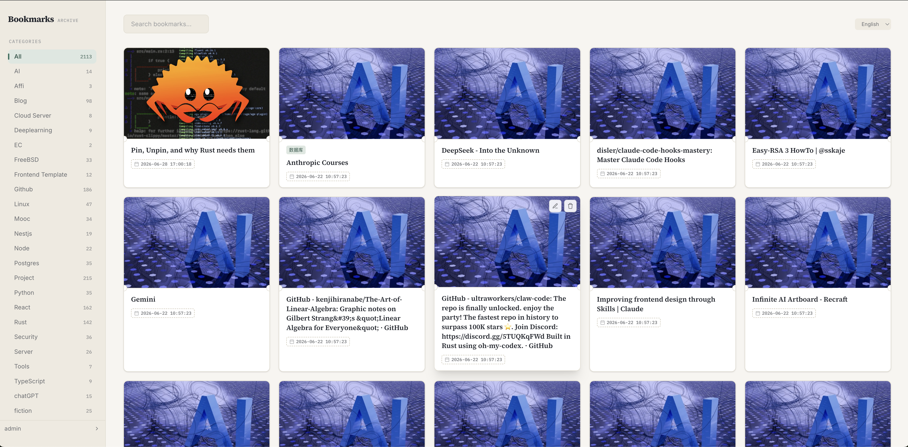
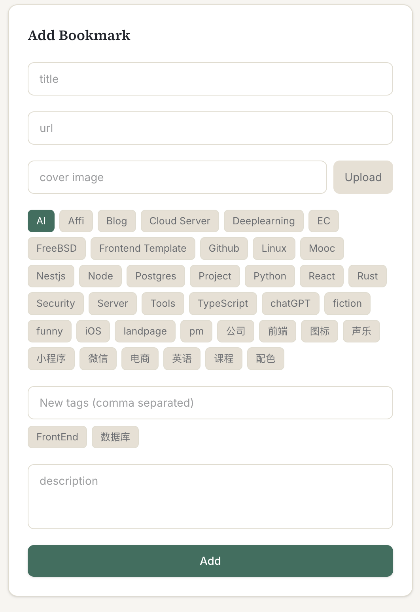
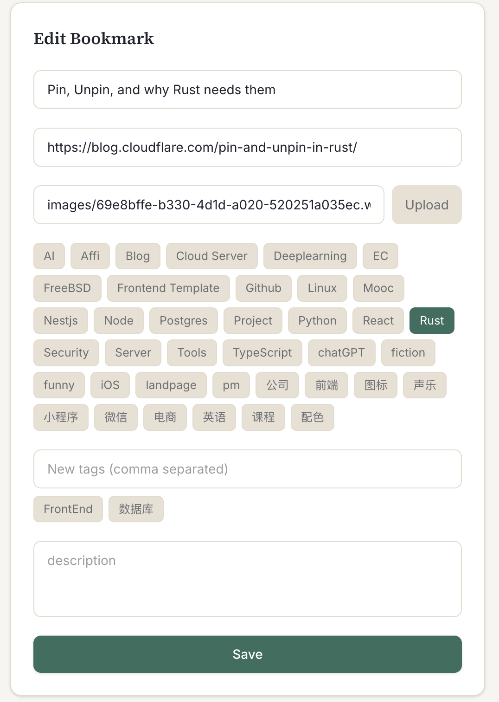
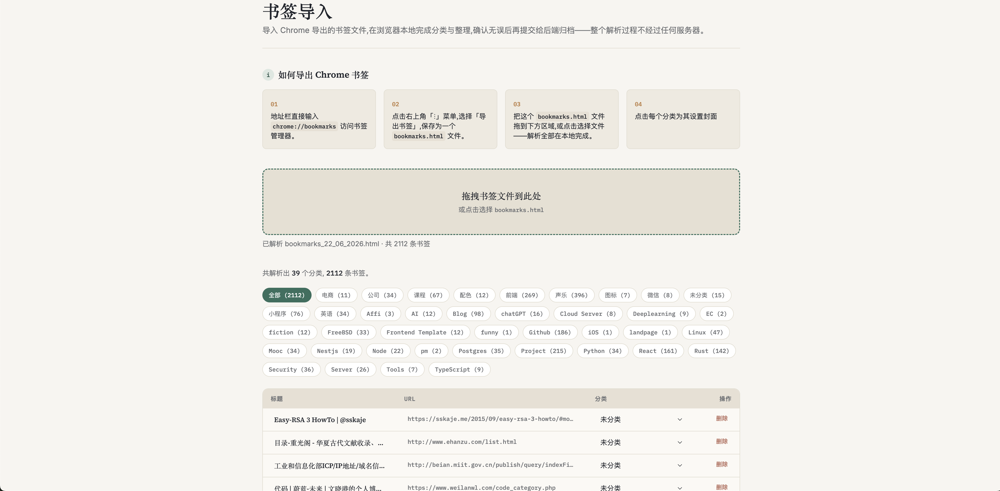
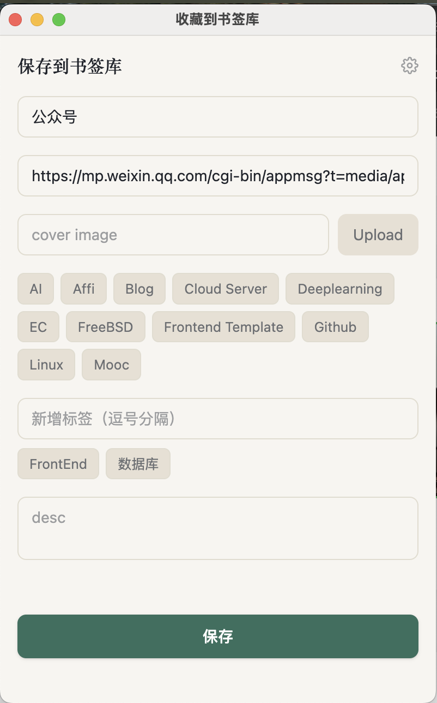
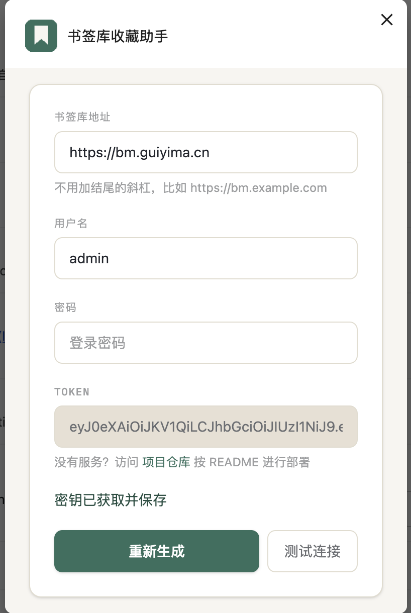

# 📖 Bookmark Manager

一个基于 Rust 生态构建的高性能、轻量级书签管理 Web 应用。

[Chrome 插件](https://chromewebstore.google.com/detail/%E4%B9%A6%E7%AD%BE%E5%BA%93%E6%94%B6%E8%97%8F%E5%8A%A9%E6%89%8B/ofaddkoiobjlandaffjdckpibjpbbnkm)

[演示视频](https://www.bilibili.com/video/BV1XuKQ6mEsa)

> [在线体验](https://bks.artista.cc)
> * **用户名**：`guest`
> * **密码**：`guest`

## 📸 功能截图

### Web 端功能

| 功能 | 截图 |
| --- | --- |
| 🏠 主页 |  |
| ➕ 添加书签 |  |
| ✏️ 编辑书签 |  |
| 📥 导入书签 |  |

### 浏览器插件

| 功能 | 截图 |
| --- | --- |
| ➕ 添加书签 |  |
| ⚙️ 插件设置 |  |

### 安装和使用浏览器插件

#### 使用已编译版本（推荐）

项目根目录提供了已编译好的插件包 `bookmark-clipper-1.1.0-chrome.zip`，按以下步骤安装：

1. 下载 `bookmark-clipper-1.1.0-chrome.zip` 到任意目录
2. 打开 Chrome/Edge 浏览器，访问 `chrome://extensions`（Edge 是 `edge://extensions`）
3. 开启右上角的「开发者模式」
4. 拖动下载好的插件压缩包到 Chrome 浏览器的扩展程序页面
5. 插件安装成功后，点击浏览器工具栏的插件图标打开设置页

#### 配置插件

1. 点击插件右上角的设置图标进入设置页面
2. 在设置页面中，填写你的书签库地址（如 `https://bks.artista.cc`）、用户名、密码，然后点击保存
3. 配置完成后，可以通过以下方式收藏书签：
   - **点击插件图标**：打开弹窗，编辑标题、选择分类、添加标签后保存
   - **右键菜单**：在网页或链接上右键 →「收藏到书签库」，快速保存

#### 从源码开发插件

如需修改插件功能，进入 `browser-ext` 目录进行开发：

```bash
cd browser-ext
bun install
bun run dev      # Chrome 开发模式，热重载
```

`bun run dev` 之后，按照终端提示在 `chrome://extensions` 里加载 `.output/chrome-mv3-dev` 目录。

打包插件：
```bash
bun run build    # 编译产物在 .output/chrome-mv3
bun run zip      # 打包成 .zip 文件
```

## 🚀 特性

* **极致性能**：基于 Rust 的 `axum` 框架与 PostgreSQL 构建，内存占用低、响应速度快。
* **现代化全栈体验**：结合 `htmx` 与 `askama` 模板引擎，无需引入重量级前端框架即可实现无刷新的动态交互。
* **优雅 UI**：采用 TailwindCSS 构建，界面现代、布局响应式。
* **浏览器插件支持**：配套浏览器插件，一键保存当前页面书签。
* **生产级部署**：内置开箱即用的 Nginx、Systemd 配置，并支持多环境配置分离。

## 🛠️ 技术栈

* **后端**：Rust（`axum`）
* **数据库**：PostgreSQL + Redis（用于缓存与会话管理）
* **模板引擎**：Askama（编译期类型安全的 HTML 模板）
* **前端**：htmx + TailwindCSS + Bun（构建期工具）

---

## 💻 本地开发

如需在本地进行开发或二次开发，请确保已安装 **Rust**、**Bun** 和 **PostgreSQL**。

### 1. 初始化数据库

在 PostgreSQL 中创建名为 `bookmark` 的数据库，并执行迁移脚本：

```bash
psql -U postgres -d postgres -c "CREATE DATABASE bookmark;"
# 执行数据库迁移
psql -U postgres -d bookmark < migrations/20260624051018_init.sql
```

### 2. 编译前端资源

项目使用 `bun` 与 TailwindCSS 管理前端依赖并编译静态资源：

```bash
bun install
bun run dev
```

### 3. 启动后端服务

```bash
cargo run
```

> **🔑 默认管理员账号**
> 服务启动后，访问 `http://127.0.0.1:8000`，使用以下默认凭证登录：
> * **用户名**：`admin`
> * **密码**：`admin`（建议登录后立即修改）

---

## 🐳 Docker 部署（推荐）

使用 Docker 部署最简单，无需手动安装 Rust / PostgreSQL / Redis，只需要 Docker 和 Docker Compose。

### 方式 A：使用预构建镜像（推荐大多数用户）

```bash
# 1. 只需要 compose 文件和环境变量文件，不需要克隆整个仓库
mkdir bookmark-manager && cd bookmark-manager
curl -O https://raw.githubusercontent.com/ikeeplearn/bookmark-axum/main/docker-compose.ghcr.yml
curl -O https://raw.githubusercontent.com/ikeeplearn/bookmark-axum/main/.env.example

# 2. 复制环境变量文件并修改
cp .env.example .env
nano .env   # 至少修改 POSTGRES_PASSWORD 和 API_TOKEN_SECRET

# 3. 启动（直接从 GHCR 拉取镜像，几十秒搞定）
docker compose -f docker-compose.ghcr.yml up -d
```

### 方式 B：本地编译镜像

```bash
# 1. 克隆仓库
git clone https://github.com/ikeeplearn/bookmark-axum.git
cd bookmark-axum

# 2. 复制环境变量文件并修改
cp .env.example .env
nano .env   # 至少修改 POSTGRES_PASSWORD 和 API_TOKEN_SECRET

# 3. 构建并启动（Rust 编译较慢，第一次可能要几分钟）
docker compose up -d --build

# 4. 查看日志，确认启动成功
docker compose logs -f app
```

启动完成后访问 `http://your-server-ip:8000`，使用默认账号登录：

| 用户名 | 密码 |
| --- | --- |
| `admin` | `admin` |

**⚠️ 首次登录后请立即修改密码。**

> 更详细的 Docker 使用说明请参考 [DOCKER_DEPLOY.md](./DOCKER_DEPLOY.md)。

---

## 📦 生产部署（传统方式）

生产环境部署十分简单，只需从 Release 页面下载对应的压缩包即可。

### 1. 解压发布包

从 Release 页面下载 `bookmark.zip`，并解压到服务器目标目录（如 `/app/bookmark`）：

```bash
unzip bookmark.zip -d /app/bookmark
cd /app/bookmark
```

解压后的目录结构如下：

```text
.
├── bookmark                  # 编译好的二进制可执行文件
├── ddl.sql                   # 数据库初始化脚本
├── configuration/
│   └── base.yaml              # 配置文件
├── public/                    # 静态资源目录（JS / CSS / 图片）
├── nginx.conf                 # Nginx 示例配置
└── bookmark.service           # Systemd 服务配置文件
```

### 2. 修改配置

编辑 `configuration/base.yaml`，根据服务器实际情况调整路径与凭证：

```yaml
# 应用程序配置
application:
  # HTTP 服务监听端口
  port: 8000
  # HTTP 服务监听地址
  host: 0.0.0.0
  # 静态资源目录的绝对路径（JS/CSS/图片等）
  static_directory: "/app/bookmark/public"   # 修改为实际的绝对路径
  # 文件上传目录的绝对路径
  upload_directory: "/app/bookmark/upload"   # 修改为实际的上传路径
  # 图片转换为 WebP 时的压缩质量，取值范围 0.0-100.0（数值越高质量越好，文件越大）
  image_quality: 80.0
# 数据库配置
database:
  # PostgreSQL 主机地址
  host: "127.0.0.1"
  # PostgreSQL 端口
  port: 5432
  # PostgreSQL 用户名
  username: "postgres"
  # PostgreSQL 密码
  password: "your_secure_password"
  # PostgreSQL 数据库名
  database_name: "bookmark"
  # 是否需要 SSL 连接
  require_ssl: false
# Redis 连接地址（用于缓存和会话管理）
redis_uri: "redis://127.0.0.1:6379"
# API Token 配置（用于浏览器插件等外部应用访问）
api_token:
  # 用于签名 Token 的密钥（生产环境请使用随机生成的密钥）
  secret_key: "very-long-and-random-secret-key"
  # Token 过期时间（支持的单位：s/秒，m/分钟，h/小时，d/天）
  expire_time: 1h
```

### 3. 初始化生产数据库

确保生产环境的 PostgreSQL 已创建 `bookmark` 数据库，并执行迁移脚本：

```bash
psql -U postgres -d bookmark < ddl.sql
```

### 4. 使用 Systemd 管理服务

将自带的 `bookmark.service` 移动到系统的 systemd 目录并启动：

```bash
# 1. 复制服务文件
sudo cp bookmark.service /etc/systemd/system/

# 2. 重新加载 systemd 配置
sudo systemctl daemon-reload

# 3. 启动服务并设置开机自启
sudo systemctl enable --now bookmark

# 4. 查看运行状态
sudo systemctl status bookmark
```

> **💡 提示**：请确保 `bookmark.service` 中的 `ExecStart` 与 `WorkingDirectory` 指向实际的解压路径（如 `/app/bookmark`）。

### 5. Nginx 反向代理

如需启用自定义域名或 SSL，可参考附带的 `nginx.conf` 进行配置，并将其合并到你的 Nginx 配置中（通常位于 `/etc/nginx/sites-available/`）：

```nginx
server {
    listen 80;
    server_name yourdomain.com;

    location / {
        proxy_pass http://127.0.0.1:8000;
        proxy_set_header Host $host;
        proxy_set_header X-Real-IP $remote_addr;
        proxy_set_header X-Forwarded-For $proxy_add_x_forwarded_for;
        proxy_set_header X-Forwarded-Proto $scheme;
    }
}
```

配置完成后，重启 Nginx：

```bash
sudo nginx -s reload
```

---

## 🔒 初始登录信息

服务启动成功后，请使用系统预设的管理员账号首次登录：

| 字段 | 初始值 |
| --- | --- |
| **用户名（Username）** | `admin` |
| **密码（Password）** | `admin` |

> **⚠️ 安全提示**：为保障数据安全，请在首次登录成功后立即前往设置页面修改默认密码。

---

## 📄 开源协议

本项目采用 [MIT](LICENSE) 协议开源。

## 联系方式

如有疑问，请联系开发者。


